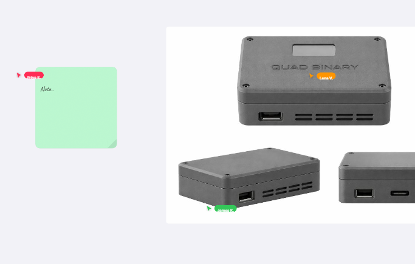

<div align="center">
  <h1 style="font-size: 3rem;">✨ Inkspace</h1>
  <p><strong>Your thoughts, unfiltered. The infinite-canvas visual workspace.</strong></p>
  
  <p>
    Inkspace is a beautiful, modern, infinite-canvas collaboration tool designed to help you drag, drop, connect, and brainstorm at the speed of thought. Whether you're mapping out complex AWS architectures or sketching a weekend startup idea, Inkspace gives you the boundless room you need to create.
  </p>

  <p>
    <a href="#-features--templates">Features</a> •
    <a href="#-getting-started">Getting Started</a> •
    <a href="#-tech-stack">Tech Stack</a> •
    <a href="#-project-architecture">Architecture</a>
  </p>
</div>

<br/>

<div align="center">
  <a href="https://task-eight-psi-64.vercel.app/">
    
  </a>
</div>

<br/>

> *"The best ideas don't fit in a linear document. They need space to breathe, connect, and evolve."* 

Inkspace blends a premium, floating **glassmorphic UI** with a mesmerizing **infinite dot-grid background**, making every interaction feel buttery smooth and incredibly satisfying.

---

## 🚀 Features & Templates

Inkspace comes loaded with out-of-the-box superpowers and expertly crafted templates designed for specific workflows. Say goodbye to starting from a blank page.

- **♾️ Infinite Drag-and-Drop Canvas:** Pan, zoom, and place nodes effortlessly on a GPU-accelerated canvas.
- **⚡ Real-Time Collaboration:** Powered by Liveblocks and Yjs. See your teammates' cursors fly across the screen instantly.
- **🌗 Seamless Dark Mode:** Flawless light/dark mode transitions that update the canvas and UI without a page reload.

### 🎨 The 6 Starter Templates
1. **☁️ System Design:** AWS-style architecture diagrams with beautifully routed node connections for mapping out infrastructure.
2. **🗺️ Product Roadmap:** Kanban-style swimlanes perfect for Q1/Q2/Q3 planning and tracking deliverables.
3. **💡 Brainstorming:** Rotated, vibrant sticky notes connecting to a central idea using handwriting typography for an organic feel.
4. **🌳 DSA Flowchart:** A clean Binary Search Tree visualizer to map out algorithms and complex logic flows.
5. **🚀 Startup Planning:** A Lean Canvas grid template designed specifically for founders to validate ideas quickly.
6. **🤖 AI Workflow:** A sleek, dark-mode node builder specialized for chaining LLMs (Claude/GPT-4) and vector databases.

---

## 📂 Project Architecture

Inkspace is beautifully organized using the Next.js App Router paradigm. Here is a high-level look at the codebase (`Treeify` structure):

```text
src/
├── app/                       # Next.js 14 App Router
│   ├── board/[id]/            # Dynamic canvas workspace pages
│   ├── boards/                # Dashboard to manage existing boards
│   ├── layout.tsx             # Root layout & providers
│   └── page.tsx               # Stunning landing page
├── components/                # Modular React components
│   ├── canvas/                # Core WebGL/DOM canvas, panning, zooming
│   ├── collab/                # Real-time remote & simulated cursors
│   ├── elements/              # Renderers for shapes, text, and sticky notes
│   └── ui/                    # Glassmorphic panels, modals, and toolbars
│       ├── TemplateModal.tsx  # The 6-template gallery modal
│       └── CommandPalette.tsx # ⌘K fast-action menu
├── hooks/                     # Custom React hooks (useCollabSync, useImageDrop)
├── lib/                       # External library integrations (Yjs, Liveblocks)
├── store/                     # Zustand state management (Canvas, Boards, Collab)
├── styles/                    # Tailwind directives & CSS Variables (Dark mode)
└── utils/                     # Helpers (image processing, math)
```

---

## 🛠 Tech Stack

Built with the modern web in mind. Fast, scalable, and fully typed.

- **Frontend Framework:** [Next.js 14](https://nextjs.org/) (App Router)
- **UI & Styling:** [React](https://react.dev/), [Tailwind CSS](https://tailwindcss.com/)
- **State Management:** [Zustand](https://github.com/pmndrs/zustand)
- **Collaboration Engine:** [Liveblocks](https://liveblocks.io/) + [Yjs](https://docs.yjs.dev/)
- **Typography:** `Inter` (UI) and `Caveat` (Sticky Notes)
- **Deployment:** [Vercel](https://vercel.com/)

---

## 🏁 Getting Started

Ready to spin up your own collaborative canvas? It takes less than two minutes.

### 1. Clone the repository
```bash
git clone https://github.com/your-username/inkspace.git
cd inkspace
```

### 2. Install dependencies
```bash
npm install
# or
yarn install
```

### 3. Configure Liveblocks (Optional but recommended)
To enable true real-time collaboration:
1. Go to [Liveblocks.io](https://liveblocks.io/) and create a free account.
2. Get your **Public API Key**.
3. Open `src/lib/yjs.ts` and replace the placeholder `publicApiKey` with your key.

### 4. Fire up the Dev Server
```bash
npm run dev
```

### 5. Start Brainstorming
Open [https://task-eight-psi-64.vercel.app/](https://task-eight-psi-64.vercel.app/) in your browser (or localhost if running locally). Create a new board, pick a template, and invite a friend!

---

<div align="center">
  <b>Built with ❤️ by thinkers, for thinkers.</b><br/>
  <a href="https://github.com/your-username/inkspace/issues">Report a Bug</a> • 
  <a href="https://github.com/your-username/inkspace/pulls">Request a Feature</a>
</div>
